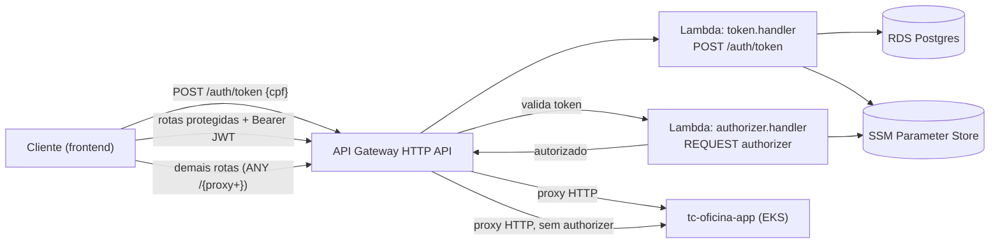

# tc-oficina-lambda-auth

Lambda de autenticação de cliente por CPF + API Gateway.

Parte do sistema da oficina mecânica (Tech Challenge FIAP SOAT, Fase 3, grupo Integradores).

## Propósito

Substitui autenticação de cliente por usuário/senha por um fluxo simples baseado em CPF:
o cliente informa o CPF, a Lambda confere se existe um cliente ativo com esse documento no
banco da oficina e devolve um JWT de curta duração. Esse token é exigido pelo API Gateway
(via Lambda Authorizer) nas rotas sensíveis do cliente, que são então repassadas para a API
da oficina (`tc-oficina-app`, rodando no EKS).

Usuários internos (mecânico, atendente etc.) continuam autenticando pela própria API da
oficina — o token emitido por essa Lambda tem `type: "cliente"` e é rejeitado pelo
authorizer se vier de outro fluxo.

## Contrato do endpoint

### `POST /auth/token`

Requisição:

```json
{ "cpf": "12345678901" }
```

CPF aceito com ou sem máscara (dígitos não numéricos são removidos antes da validação).

Respostas:

| Situação                                   | Status | Body                                  |
| ------------------------------------------ | ------ | -------------------------------------- |
| CPF válido, cliente ativo                  | `200`  | `{ "token": "<jwt>", "expiresIn": 3600 }` |
| Body ausente/inválido ou CPF malformado    | `400`  | `{ "message": "CPF inválido" }` (ou erro de parse de body) |
| CPF inexistente na base, ou cliente inativo | `401`  | `{ "message": "Não autorizado" }`      |

O `401` é intencionalmente genérico: não diferencia "CPF não existe" de "cliente inativo",
para não vazar informação sobre a base de clientes. O JWT tem payload
`{ sub, nome, cpf, type: "cliente" }`, assinado com HS256, expiração de 1h.

## Arquitetura



Rotas expostas pelo API Gateway (`terraform/gateway.tf`):

- `POST /auth/token` — pública, integra direto com a Lambda `token`.
- `GET /os/acompanhamento/{numero}`, `POST /os/{numero}/orcamento/aprovar`,
  `POST /os/{numero}/orcamento/rejeitar` — protegidas pelo authorizer `cliente-jwt`
  (`authorization_type = CUSTOM`), proxy HTTP para o load balancer do app.
- `ANY /{proxy+}` — catch-all sem authorizer, proxy HTTP para o app (rotas internas/públicas
  da própria API da oficina).

O authorizer é do tipo `REQUEST`, lê o header `Authorization: Bearer <token>`, valida
assinatura HS256 e exige `type: "cliente"` no payload — um token de usuário interno emitido
pela própria API da oficina não passa nessa checagem. Todas as integrações de proxy
propagam `x-request-id` (`$context.requestId` do gateway) para correlação de logs com o app.

As duas Lambdas rodam com `LabRole` (sem VPC), Node.js 22.

## Variáveis e parâmetros consumidos

Todos os parâmetros são lidos do SSM Parameter Store em runtime (com cache em memória por
invocação "quente"), namespaceados por ambiente via a env var `ENVIRONMENT` (`homolog` ou
`prod`) injetada nas duas Lambdas:

| Parâmetro SSM                          | Usado por             | Descrição                                  |
| --------------------------------------- | ---------------------- | ------------------------------------------- |
| `/oficina/<env>/database-url`           | `token` (via `lib/db`) | connection string do RDS (tabela `clientes`) |
| `/oficina/<env>/jwt-secret`             | `token`, `authorizer`  | segredo HS256 para assinar/validar o JWT    |
| `/oficina/<env>/app-lb-hostname`        | Terraform (`data.tf`) | hostname do load balancer do `tc-oficina-app`, usado para montar a URL de proxy das rotas do gateway |

Esses parâmetros são provisionados pelos repositórios `tc-oficina-infra-db` e
`tc-oficina-app` — esta Lambda apenas os consome.

## Como rodar os testes

```bash
npm ci
npm test
```

Suíte em `test/` cobre validação de CPF, o handler de `/auth/token` (200/400/401) e o
authorizer (token ausente, inválido, expirado, `type` diferente de `cliente`).

## Como fazer o build/pacote local

```bash
npm run build     # esbuild -> dist/
npm run package   # build + zip (dist -> lambda.zip), usado pelo terraform
```

## Como fazer deploy

Deploy é automático via GitHub Actions (`.github/workflows/cd.yml`):

- push/merge em `develop` → `terraform apply` no ambiente `homolog`.
- push/merge em `main` → `terraform apply` no ambiente `prod`.

O workflow roda `npm test` + `npm run build`, garante a existência do bucket S3 de tfstate,
aplica o Terraform (`terraform/`, backend S3 com key
`fase-3/lambda-auth-<environment>.tfstate`) e faz um smoke test (`POST /auth/token` com CPF
inválido, espera `400`) contra o `api_endpoint` recém-provisionado.

Para aplicar manualmente:

```bash
cd terraform
terraform init -backend-config="key=fase-3/lambda-auth-<homolog|prod>.tfstate"
terraform apply -var "environment=<homolog|prod>"
```

Pré-requisito: os parâmetros SSM acima já existirem no ambiente alvo (providos por
`tc-oficina-infra-db` e `tc-oficina-app`).

## Teste manual de ponta a ponta

O fluxo completo (`token` → rota protegida sem token → rota protegida com token) depende do
`tc-oficina-app` já estar deployado em homolog, o que ainda não aconteceu neste ponto do
desenvolvimento. Isso é esperado, não é uma lacuna desta Lambda. Quando o app estiver no ar,
o roteiro de teste é:

```bash
API=<api_endpoint homolog>
TOKEN=$(curl -s -X POST "$API/auth/token" -H 'content-type: application/json' \
  -d '{"cpf":"<cpf de cliente ativo do seed>"}' | jq -r .token)
curl -s -o /dev/null -w '%{http_code}\n' "$API/os/acompanhamento/OS-0001"   # 401 sem token
curl -s -H "Authorization: Bearer $TOKEN" "$API/os/acompanhamento/OS-0001" # 200 com token
```
