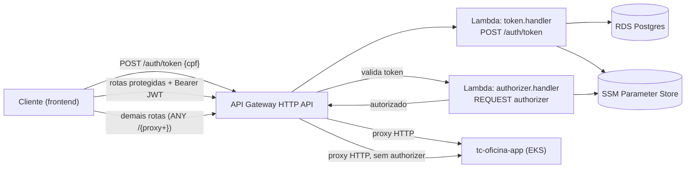

# tc-oficina-lambda-auth

Autenticação de cliente por CPF do sistema da oficina mecânica — Tech Challenge FIAP SOAT,
Fase 3, grupo **Integradores**. Duas funções AWS Lambda (Node.js 22) atrás de um API Gateway
HTTP API: uma emite o JWT a partir do CPF, a outra atua como Lambda Authorizer nas rotas
sensíveis do cliente.

## Propósito ✱

Substitui a autenticação de cliente por usuário/senha por um fluxo baseado em CPF: o cliente
informa o CPF, a Lambda `token` confere se existe um cliente **ativo** com aquele documento
no banco da oficina e devolve um JWT de curta duração (HS256, expiração de 1h, claim
`type: "cliente"`). Esse token é exigido pelo API Gateway — via a Lambda `authorizer` — nas
rotas sensíveis do cliente, que são então repassadas por proxy HTTP para a API da oficina
(`tc-oficina-app`, no EKS).

Usuários internos (mecânico, atendente etc.) continuam autenticando pela própria API da
oficina. O token emitido aqui tem `type: "cliente"` e é rejeitado pelo authorizer se vier de
outro fluxo. Este repositório não tem estado próprio compartilhado: consome tudo do SSM
Parameter Store, provisionado por `tc-oficina-infra-db` e `tc-oficina-app`.

## Tecnologias ✱

- Node.js 22 + TypeScript
- AWS Lambda (runtime `nodejs22.x`, role `LabRole`, sem VPC)
- API Gateway HTTP API (`AWS::ApiGatewayV2`), Lambda Authorizer do tipo `REQUEST` (cache 300s)
- `jsonwebtoken` (HS256), `pg` (consulta ao RDS), AWS SDK v3 (SSM)
- Terraform ≥ 1.10 (backend S3 com `use_lockfile`), providers `hashicorp/aws`
- esbuild (bundle) + zip para empacotar
- Jest (testes de `cpf`, handler `token` e `authorizer`)
- GitHub Actions — CI (`npm test` + build) e CD (`terraform apply` por ambiente)

## Arquitetura deste repositório ✱



Rotas expostas pelo API Gateway (`terraform/gateway.tf`):

- `POST /auth/token` — pública, integra direto com a Lambda `token`.
- `GET /os/acompanhamento/{numero}`, `POST /os/{numero}/orcamento/aprovar`,
  `POST /os/{numero}/orcamento/rejeitar` — protegidas pelo authorizer `cliente-jwt`
  (`authorization_type = CUSTOM`), proxy HTTP para o load balancer do app.
- `ANY /{proxy+}` — catch-all sem authorizer, proxy HTTP para o app (rotas internas/públicas
  da própria API da oficina).

O authorizer é do tipo `REQUEST`, lê `Authorization: Bearer <token>`, valida a assinatura
HS256 e exige `type: "cliente"` no payload — um token de usuário interno emitido pela própria
API não passa. Todas as integrações de proxy propagam `x-request-id` (`$context.requestId`)
para correlação de logs com o app. As duas Lambdas rodam com `LabRole`, sem VPC.

Documentação arquitetural completa (componentes, sequências, RFCs, ADRs, DER):
[`docs/arquitetura/`](https://github.com/FIAP-POS-TECH-SOFTWARE-ARCHITECTURE/tc-oficina-app/tree/main/docs/arquitetura)
no `tc-oficina-app`. O fluxo deste repositório está em
[`sequencia-autenticacao.md`](https://github.com/FIAP-POS-TECH-SOFTWARE-ARCHITECTURE/tc-oficina-app/blob/main/docs/arquitetura/sequencia-autenticacao.md)
e nas [ADR-002](https://github.com/FIAP-POS-TECH-SOFTWARE-ARCHITECTURE/tc-oficina-app/blob/main/docs/arquitetura/adrs/adr-002-api-gateway-http-com-lambda-authorizer.md)
/ [ADR-003](https://github.com/FIAP-POS-TECH-SOFTWARE-ARCHITECTURE/tc-oficina-app/blob/main/docs/arquitetura/adrs/adr-003-jwt-hs256-segredo-compartilhado.md).

### Contrato do endpoint

**`POST /auth/token`** — corpo `{ "cpf": "12345678901" }` (aceita com ou sem máscara).

| Situação | Status | Body |
| --- | --- | --- |
| CPF válido, cliente ativo | `200` | `{ "token": "<jwt>", "expiresIn": 3600 }` |
| Body ausente/inválido ou CPF malformado | `400` | `{ "message": "CPF inválido" }` |
| CPF inexistente na base, ou cliente inativo | `401` | `{ "message": "Não autorizado" }` |

O `401` é intencionalmente genérico: não diferencia "CPF não existe" de "cliente inativo",
para não vazar informação sobre a base de clientes. Payload do JWT:
`{ sub, nome, cpf, type: "cliente" }`.

Rotas protegidas (servidas pelo `tc-oficina-app`, atrás do authorizer): `200` com dados da
OS, `401` sem token / token inválido / expirado, `403` se a OS pertence a outro cliente,
`404` se a OS não existe.

## Como executar localmente ✱

Pré-requisitos: Node.js 22, `npm`.

```bash
npm ci
npm test          # cpf, handler token (200/400/401), authorizer (ausente/inválido/expirado/type errado)
npm run build     # esbuild -> dist/
npm run package   # build + zip (dist -> lambda.zip), usado pelo terraform
```

Não há servidor HTTP local: as Lambdas rodam sob o runtime da AWS. O fluxo ponta a ponta
(token → rota protegida sem token → rota protegida com token) exige o `tc-oficina-app`
deployado em homolog:

```bash
API=<api_endpoint homolog>
TOKEN=$(curl -s -X POST "$API/auth/token" -H 'content-type: application/json' \
  -d '{"cpf":"<cpf de cliente ativo do seed>"}' | jq -r .token)
curl -s -o /dev/null -w '%{http_code}\n' "$API/os/acompanhamento/OS-0001"   # 401 sem token
curl -s -H "Authorization: Bearer $TOKEN" "$API/os/acompanhamento/OS-0001"  # 200 com token
```

### Parâmetros SSM consumidos

Lidos em runtime (cache em memória por invocação quente), namespaceados por `ENVIRONMENT`
(`homolog`/`prod`):

| Parâmetro SSM | Usado por | Descrição |
| --- | --- | --- |
| `/oficina/<env>/database-url` | `token` (via `lib/db`) | connection string do RDS (tabela `clientes`) |
| `/oficina/<env>/jwt-secret` | `token`, `authorizer` | segredo HS256 para assinar/validar o JWT |
| `/oficina/<env>/app-lb-hostname` | Terraform (`data.tf`) | hostname do LB do `tc-oficina-app`, para montar a URL de proxy |

Provisionados por `tc-oficina-infra-db` e `tc-oficina-app` — esta Lambda apenas consome.

## Deploy ✱

Automático via GitHub Actions (`.github/workflows/cd.yml`):

- push/merge em `develop` → `terraform apply` no ambiente `homolog`.
- push/merge em `main` → `terraform apply` no ambiente `prod`.

O workflow roda `npm test` + `npm run build`, garante o bucket S3 de `tfstate` (a conta
Academy pode resetá-lo entre sessões), aplica o Terraform (`terraform/`, backend S3 key
`fase-3/lambda-auth-<environment>.tfstate`) e faz um smoke test (`POST /auth/token` com CPF
inválido, espera `400`) contra o `api_endpoint` recém-provisionado.

Secrets necessários no repositório: `AWS_ACCESS_KEY_ID`, `AWS_SECRET_ACCESS_KEY`,
`AWS_SESSION_TOKEN` (Learner Lab, rotativos). Deploy manual de contingência:

```bash
cd terraform
terraform init -backend-config="key=fase-3/lambda-auth-<homolog|prod>.tfstate"
terraform apply -var "environment=<homolog|prod>"
```

Pré-requisito: os parâmetros SSM acima já existirem no ambiente alvo.

## Links ✱

- **Deploy ativo:** URL do API Gateway = output `api_endpoint` do `terraform apply` (conta
  AWS Academy — disponível sob demanda, com o lab ligado).
- **Swagger:** não se aplica — a autenticação roda como Lambda atrás do API Gateway, sem
  servidor HTTP próprio. O Swagger da API da oficina fica no `tc-oficina-app`
  (`http://localhost:3000/docs`).
- **Collection Bruno / Postman:** [`bruno/Auth-CPF`](bruno/Auth-CPF) (abrir com
  [Bruno](https://www.usebruno.com/downloads) via **Open Collection**, escolher o ambiente
  **Homolog**/**Prod**, preencher `gatewayUrl`, `cpf` e `osNumero`, rodar
  `Auth > Emitir Token (CPF)` — o script salva o JWT na variável `token`) ·
  export equivalente: [`bruno/auth-cpf.postman_collection.json`](bruno/auth-cpf.postman_collection.json).
- **Documentação arquitetural:** [`docs/arquitetura/`](https://github.com/FIAP-POS-TECH-SOFTWARE-ARCHITECTURE/tc-oficina-app/tree/main/docs/arquitetura)
- **Demais repositórios da solução:**
  [`tc-oficina-app`](https://github.com/FIAP-POS-TECH-SOFTWARE-ARCHITECTURE/tc-oficina-app) ·
  [`tc-oficina-infra-k8s`](https://github.com/FIAP-POS-TECH-SOFTWARE-ARCHITECTURE/tc-oficina-infra-k8s) ·
  [`tc-oficina-infra-db`](https://github.com/FIAP-POS-TECH-SOFTWARE-ARCHITECTURE/tc-oficina-infra-db)
